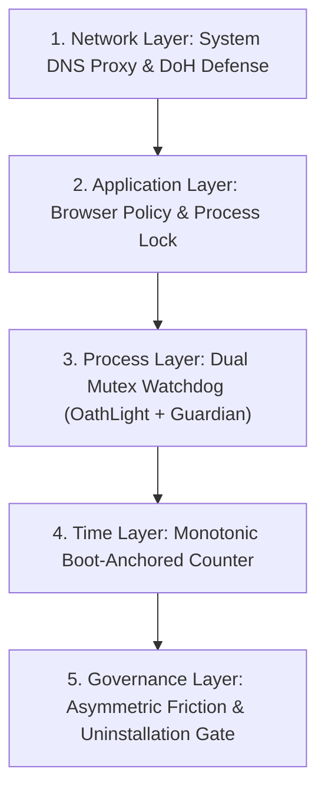

# Anti-Bypass Architecture and Tamper Resistance

Oath Light implements a robust, multi-layered anti-bypass framework engineered to withstand unauthorized application modification, process termination, system clock manipulation, network proxy overrides, and uninstallation attempts.

---

## Foundational Security Principles

* **Self-Enforcing Defense**: Security rules, process watchdogs, and network proxies are protected at system startup and runtime by native background processes.
* **100% Privacy and Zero Telemetry**: All anti-bypass controls execute entirely offline on local machine resources. Zero violation logs, process events, or device identifiers are sent to external servers.
* **100% Free and Open Source**: All security features, watchdogs, and tamper resistance modules are included under the GNU General Public License v3.0 (GPLv3) without paywalls or subscriptions.

---

## Downloads and Verified Artifacts

Official compiled setup releases are published directly on GitHub:

* **Official Releases**: [Oath Light GitHub Releases](https://github.com/Xeno-legit/Oath-light/releases)
* **Installer Package**: `OathLight_Setup.exe` (SHA-256 integrity hashes accompany each release).

---

## Multi-Tier Anti-Bypass Layered Matrix

The table below outlines how each defensive layer operates in tandem to enforce tamper resistance.

| Defensive Layer | Subsystem Location | Primary Security Responsibility | Key Implementation Primitive |
| :--- | :--- | :--- | :--- |
| **Layer 1: Network** | `oathlight-dns` | Intercepts port 53 DNS lookups and blocks DoH endpoints. | Loopback UDP proxy listening on `127.0.0.1:53`. |
| **Layer 2: Application** | `browser_lock.rs` | Enforces enterprise browser policies and monitors browser instances. | Registry policy key verification & process management. |
| **Layer 3: Process** | `watchdog.rs` & `guardian` | Protects processes from Task Manager termination attempts. | Dual Win32 mutex handles (`Main.v1` and `Guardian.v1`). |
| **Layer 4: Hardware Time** | `friction.rs` | Defeats system clock backdating and forward-dating attacks. | Boot-anchored monotonic counter (`std::time::Instant`). |
| **Layer 5: Governance** | `settings.rs` & `uninstall.rs` | Gates settings edits and uninstallation teardown. | Mandatory floor (`force_mandatory`) & Argon2id auth. |

---

## Common Bypass Vectors vs Oath Light Defensive Controls

The table below details how Oath Light structurally counters potential bypass vectors.

| Common Bypass Vector | Attempted User Vector | Oath Light Structural Control |
| :--- | :--- | :--- |
| **System Process Termination** | Terminating `OathLight.exe` using Windows Task Manager or command prompt. | Windowless `oathlightguard.exe` detects mutex vanishing and instantly resurrects the main application process. |
| **System Clock Forward-Dating** | Advancing Windows system date/time to force cool-off timer completion. | Hardware monotonic timer (`std::time::Instant`) measures elapsed CPU cycles, freezing cool-off timers and logging anomalies. |
| **Local Settings File Editing** | Manually altering `%APPDATA%\OathLight\settings.json` to disable filters. | Runtime settings floor (`settings::force_mandatory`) inspects settings on load and overrides unauthorized modifications. |
| **Browser Extension Removal** | Disabling or uninstalling browser extension via browser settings menu. | Enterprise management policy registry subkeys prevent extension removal; unmanaged browser instances are closed. |
| **DNS Resolver Override** | Changing Windows network adapter DNS settings to bypass domain blocking. | `oathlight-dns` continuously re-asserts loopback adapter takeover and monitors upstream resolver health. |
| **DoH Encrypted Bypass** | Enabling DNS-over-HTTPS in browser to bypass port 53 DNS proxying. | Known DoH provider domains and IPs are blocked at the DNS layer; browser policies enforce native DoH disabling. |
| **Unauthorized Uninstallation** | Running `uninstall.exe` or using Windows Apps & Features to delete app. | Setup uninstaller invokes CLI gate (`--uninstall-check`), blocking removal until cool-off elapses or master key is provided. |

---

## Automated Anti-Bypass Testing Coverage

Tamper resistance controls are continuously verified through automated unit tests across the Rust workspace.

| Test Suite Module | Subsystem Target | Verified Security Behavior |
| :--- | :--- | :--- |
| `friction::tests` | Hardware Monotonic Counter | Verifies cool-off timer accuracy and clock-tamper anomaly logging. |
| `watchdog::tests` | Process Mutex Monitor | Asserts correct mutex name agreement and resurrection dispatch. |
| `oathlight-dns` | System DNS Proxy | Validates NXDOMAIN responses for blocked domains and health probe stability. |
| `uninstall::tests` | Setup Verification Gate | Asserts cool-off enforcement and Argon2id hash verification logic. |

---

## Responsible Disclosure of Critical Bypass Vulnerabilities

Security researchers, red teams, and users who discover a critical bypass flaw or security vulnerability must adhere to private disclosure protocols.

> [!IMPORTANT]
> If a critical bypass vulnerability, kernel-level tampering flaw, or zero-day restriction override is discovered, **it must NOT be discussed or published publicly on GitHub issues, forums, or public chat channels**.
>
> All critical bypass findings must be reported privately to the lead developer via email at **abdelhamidalielsebaie@gmail.com** or through a private GitHub Security Advisory. Private disclosures enable the development team to analyze, verify, and deploy a resolution before public release.

