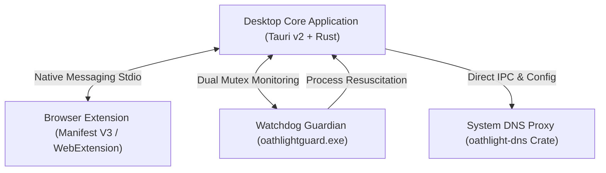

# Oath Light

Oath Light is an open-source, privacy-first, zero-telemetry content blocker and local artificial intelligence protection system. Engineered specifically for Windows desktop environments and modern web browsers, Oath Light delivers comprehensive, multi-layered protection against explicit content, digital addiction, and unauthorized application modification.

---

## Core Guarantees and Operational Standards

Oath Light operates under three fundamental, unalterable design principles:

* **100% Free Forever**: Oath Light is fully open-source under the GNU General Public License v3.0 (GPLv3). Every feature, artificial intelligence model, network filter, and security rule is completely free. No subscription models, paid features, or premium tiers will ever exist.
* **Zero Telemetry and Absolute Privacy**: Oath Light processes all data locally on your computer. The software collects zero user metrics, logs no personal identifiers, transmits no browsing analytics, and performs all image screening and DNS filtering on local hardware resources.
* **Uncompromising Engineering Excellence**: Built with Rust and modern native browser integrations, Oath Light ensures minimal memory footprint, maximum execution speed, rock-solid system stability, and strict tamper resistance.

---

## Downloads and Installation

### Quick Start for Users (Pre-Built Installer)

End users can install Oath Light directly using the official pre-compiled setup package without needing developer tools or build environments.

1. Navigate to the official releases page: [Oath Light GitHub Releases](https://github.com/Xeno-legit/Oath-light/releases).
2. Download the latest installer executable: `OathLight_Setup.exe`.
3. Launch `OathLight_Setup.exe` and follow the setup wizard to complete installation.
4. The installer automatically registers the local DNS filter, deploys background watchdog protection, and configures supported web browsers.

### System Requirements

| Specification | Minimum Requirement | Recommended Specification |
| :--- | :--- | :--- |
| **Operating System** | Windows 10 (64-bit, Build 19041+) | Windows 11 (64-bit, Latest Version) |
| **Processor** | Intel Core i3 (4th Gen) or AMD Ryzen 3 | Intel Core i5 / AMD Ryzen 5 or higher |
| **System Memory (RAM)** | 4 GB RAM | 8 GB RAM or higher |
| **Graphics Processing** | Direct3D 11 compatible GPU / iGPU | Dedicated GPU with DirectML support |
| **Web Browsers** | Chrome, Edge, Brave, Firefox, Opera | Google Chrome or Microsoft Edge |

---

## Competitive Analysis Matrix

Oath Light delivers state-of-the-art protection by combining local machine learning vision models, network-level DNS proxying, and native browser API interception. The table below outlines how Oath Light compares to existing consumer solutions.

| Feature / Architectural Axis | Oath Light | Canopy | Covenant Eyes | Cold Turkey | Tech Lockdown | PixelCage |
| :--- | :--- | :--- | :--- | :--- | :--- | :--- |
| **Pricing Model** | 100% Free Open Source | Paid Subscription | Paid Subscription | One-Time Purchase | Paid Subscription | One-Time Purchase |
| **Data Privacy & Telemetry** | Zero Telemetry (100% Local) | Remote Cloud Filtering | Server Screenshot Upload | Local Storage | Cloud / Remote DNS | 100% Local |
| **Multilingual Domain Matching** | 41 Languages + Homoglyphs | Basic Category List | Standard Blacklists | Manual / Standard Lists | Cloud DNS Categories | None |
| **Per-Item Platform Stripping** | 44 Platforms (API Interception) | Generic Page Blur | None | Whole-Site Blocking | Whole-Site Blocking | None |
| **Local AI Screen Inspection** | SigLIP2 + NudeNet Ensemble | Remote / Cloud AI | Screenshot Capture AI | None | None | NudeNet GPU Overlay |
| **Asymmetric Friction Model** | Enforced 24-Hour Cool-Off | Partner Approval | Partner Reporting | Session Timer Lock | MDM Profile Lock | None |
| **Clock-Tamper Immunity** | Boot-Anchored Monotonic Timer | None | Server Sync Required | None | None | None |
| **System-Level DNS Filtering** | Native Local Loopback Proxy | Remote VPN / Proxy | System Proxy | Host File Modifications | Cloud DNS Resolver | None |
| **Dual-Process Watchdog** | Dual Mutex + Task Scheduler | Service Monitoring | Service Monitoring | System Service | OS MDM Enforcement | None |
| **Source Availability** | Open Source (GPLv3) | Proprietary | Proprietary | Proprietary | Proprietary | Proprietary |

---

## Architecture and Subsystem Organization

Oath Light uses a modular, multi-tier architecture to separate system-level privileges, background process monitoring, network proxying, and browser extension hooks.



### Component Responsibilities Matrix

| Subsystem Component | Module Location | Technology Stack | Primary Operational Responsibility |
| :--- | :--- | :--- | :--- |
| **Desktop Application Core** | `desktop-app/src-tauri` | Tauri v2, Rust, React | Hosts UI, local AI models, Argon2id auth, settings, and IPC interfaces. |
| **System DNS Proxy** | `dns` | Pure Rust (`oathlight-dns`) | Intercepts port 53 DNS traffic, enforces blocklists, blocks DoH endpoints. |
| **Watchdog Guardian** | `desktop-app/guardian` | Pure Rust (`oathlightguard`) | Windowless background process maintaining cross-process mutex locks. |
| **Browser Extension** | `extension` | Manifest V3 / WebExtension | Intercepts platform APIs, strips explicit items, forces safe search. |
| **Shared Core Engine** | `core` | Pure Rust (`oathlight-core`) | Houses 385k embedded domains, 41-language engine, and event logging. |

---

## Advanced Capabilities and Feature Matrix

### 1. Deterministic Per-Item Platform Stripping (44 Platforms)

Rather than blocking entire websites, Oath Light inspects native JSON network responses and strips explicit posts, videos, comments, and media items prior to browser rendering.

| Filtering Mode | Platform Count | Example Platforms Supported | Detection Mechanism & Target Labels |
| :--- | :--- | :--- | :--- |
| **API / JSON Interception** | 26 Platforms | Reddit, X (Twitter), Twitch, Kick, Tumblr, Steam, Danbooru, Gelbooru, Patreon | Parses native API JSON payloads for flags like `over_18`, `possibly_sensitive`, `contentClassificationLabels`, `is_mature`. |
| **DOM-Tier Filtering** | 10 Platforms | Rule34, E621, Hypnohub, FurAffinity, InkBunny, Newgrounds | Scrubs server-rendered HTML elements and media containers in real time. |
| **Safe-Mode Enforcement** | 7 Platforms | YouTube, Spotify, Instagram, TikTok, character.ai, poe, huggingface | Forces platform safe search, Restricted Mode, and tags adult search paths. |
| **Sub-Unit Monitoring** | 1 Platform | Discord | Monitors text and media channels via native client IPC hooks. |

### 2. Local Artificial Intelligence Screening Ensemble

Oath Light runs real-time screen inspection using a local multi-model artificial intelligence ensemble.

| Model Component | Architecture | Processing Framework | Detection Target & Role |
| :--- | :--- | :--- | :--- |
| **Image-Guard-2.0** | SigLIP2-base (Vision Transformer) | Local ONNX Runtime (`ort`) | 5-class classification model identifying explicit screen content. |
| **NudeNet Detector** | NudeNet ONNX Model | Local ONNX Runtime (`ort`) | Object detection model highlighting specific anatomical explicit regions. |
| **Frame Screen Capture** | Native Desktop Capture | `xcap` Rust Crate | Captures display frames directly from GPU framebuffer memory. |
| **Overlay Window Defense** | Windows Win32 API | `WDA_EXCLUDEFROMCAPTURE` | Tags action overlay so screening engine never processes its own window. |

### 3. Multilingual Keyword and Homoglyph Engine

The embedded matching engine in `oathlight-core` analyzes domain names and URLs without requiring cloud connectivity.

| Feature Metric | Capability Standard | Description |
| :--- | :--- | :--- |
| **Language Coverage** | 41 Languages | Full keyword dictionary supporting international domain variations. |
| **Punycode Decoding** | Automatic IDN Conversion | Converts internationalized domain names (e.g., `xn--example`) to Unicode strings. |
| **Homoglyph Folding** | Character Normalization | Maps lookalike characters (e.g., Cyrillic `о` in `pоrn`) to standard ASCII. |
| **Matching Latency** | Sub-Millisecond (< 1 ms) | Performs zero-network local regex and trie lookups directly in RAM. |

---

## Building from Source (Developer Instructions)

### Developer Prerequisites
* [Rust Compiler](https://www.rust-lang.org/) (1.77.2 or higher)
* [Node.js](https://nodejs.org/) (v18 or higher) and `npm`
* Microsoft Visual Studio C++ Build Tools

### Step-by-Step Build Instructions

1. Clone the repository:
   ```bash
   git clone https://github.com/Xeno-legit/Oath-light.git
   cd Oath-light/"Oath Light Blocker"
   ```

2. Install desktop application dependencies:
   ```bash
   cd desktop-app
   npm install
   ```

3. Launch development mode:
   ```bash
   npm run tauri dev
   ```

4. Compile production installer:
   ```bash
   npm run tauri build
   ```

---

## License

Oath Light is distributed under the terms of the GNU General Public License v3.0 (GPLv3). See the [LICENSE](file:///e:/Programs%20%28Zipped%29/Oath%20Light/Oath%20Light%20Blocker/LICENSE) file for complete licensing details.
