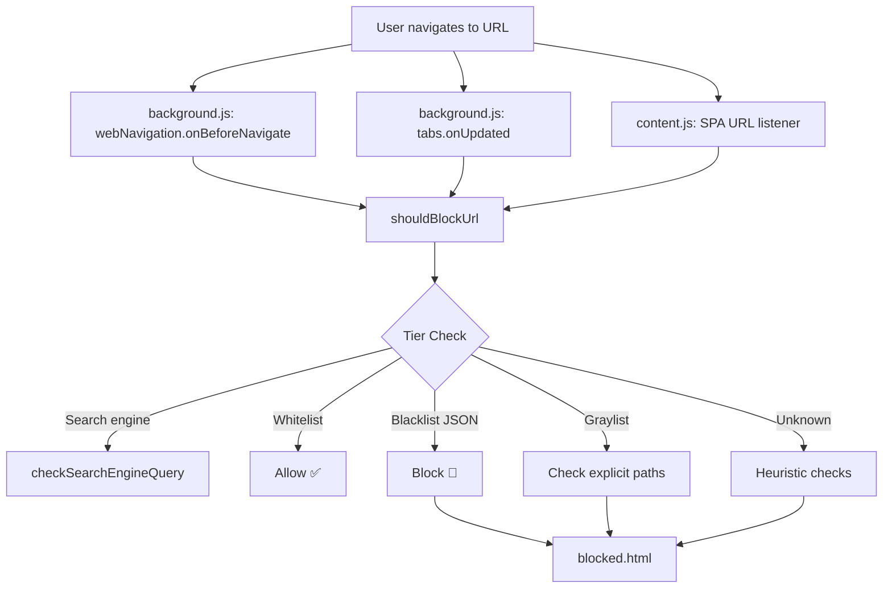

# Pure Path — Codebase Analysis & Improvement Report

## Architecture Overview



**Files at a glance:**

| File | Role | Size |
|---|---|---|
| [background.js](file:///j:/Programs%20%28Zipped%29/Pure-Path-NSFW-blocker/background.js) | Core service worker — all blocking logic | 975 lines |
| [content.js](file:///j:/Programs%20%28Zipped%29/Pure-Path-NSFW-blocker/content.js) | SPA navigation monitoring + content scanning | 189 lines |
| [blocklists.js](file:///j:/Programs%20%28Zipped%29/Pure-Path-NSFW-blocker/blocklists.js) | Blocklist manager UI logic | 716 lines |
| `popup.html/js` | Extension popup (stats + quick actions) | 730 / 62 lines |
| `blocked.html/js` | Blocked page shown to user | 157 lines |
| [blocklists/domains.json](file:///j:/Programs%20%28Zipped%29/Pure-Path-NSFW-blocker/blocklists/domains.json) | Blacklisted domains (loaded on install) | ~27 KB |
| [blocklists/keywords.json](file:///j:/Programs%20%28Zipped%29/Pure-Path-NSFW-blocker/blocklists/keywords.json) | Blocked search keywords | ~25 KB |

---

## 🐛 Bugs & Correctness Issues

### 1. Triple-firing of block checks on every navigation
Every URL change fires **three** separate listeners:
- `webNavigation.onBeforeNavigate`
- `tabs.onUpdated`
- [content.js](file:///j:/Programs%20%28Zipped%29/Pure-Path-NSFW-blocker/content.js) → `checkUrl` message

This means [shouldBlockUrl()](file:///j:/Programs%20%28Zipped%29/Pure-Path-NSFW-blocker/background.js#447-757) (and its 500+ ms polling loop) can fire 3× per navigation, inflating `stats.totalBlocks` by up to 3× and causing redundant `chrome.storage.local.set` writes.

**Fix:** Deduplicate with a `tabId → lastCheckedUrl` map in the service worker before running [shouldBlockUrl](file:///j:/Programs%20%28Zipped%29/Pure-Path-NSFW-blocker/background.js#447-757).

---

### 2. [content.js](file:///j:/Programs%20%28Zipped%29/Pure-Path-NSFW-blocker/content.js) WHITELIST and [background.js](file:///j:/Programs%20%28Zipped%29/Pure-Path-NSFW-blocker/background.js) WHITELIST are out of sync
[content.js](file:///j:/Programs%20%28Zipped%29/Pure-Path-NSFW-blocker/content.js) line 14: its local `WHITELIST_DOMAINS` includes `reddit.com`, `youtube.com`, `twitter.com` — which are **graylist** domains in [background.js](file:///j:/Programs%20%28Zipped%29/Pure-Path-NSFW-blocker/background.js). This causes content.js to **skip** its own SPA checks on graylist sites like Reddit, contradicting the intent of the graylist system.

**Fix:** Remove graylist domains from [content.js](file:///j:/Programs%20%28Zipped%29/Pure-Path-NSFW-blocker/content.js)'s `WHITELIST_DOMAINS`. Graylist domains need content monitoring, not bypassing.

---

### 3. SafeSearch blocking logic is inverted
[background.js](file:///j:/Programs%20%28Zipped%29/Pure-Path-NSFW-blocker/background.js) line 334–344: if the URL contains `safe=` or `safesearch`, the extension **blocks** the request with reason `safesearch_bypass`. But SafeSearch being **enabled** is a protective feature — blocking it punishes the user for having it on and removes an extra layer of protection.

**Fix:** Remove the SafeSearch block, or if the goal is to prevent the user from *disabling* SafeSearch, invert the logic to block only if `safe=off`.

---

### 4. `DEBUG = true` is hardcoded in [blocklists.js](file:///j:/Programs%20%28Zipped%29/Pure-Path-NSFW-blocker/blocklists.js)
[blocklists.js](file:///j:/Programs%20%28Zipped%29/Pure-Path-NSFW-blocker/blocklists.js) line 11: `const DEBUG = true;` — this floods the console in production and marginally slows the UI.

**Fix:** Set to `false` or conditionally enable (e.g., check `chrome.runtime.id` vs a dev ID).

---

### 5. `localStorage` used inside an extension page ([blocklists.js](file:///j:/Programs%20%28Zipped%29/Pure-Path-NSFW-blocker/blocklists.js))
[blocklists.js](file:///j:/Programs%20%28Zipped%29/Pure-Path-NSFW-blocker/blocklists.js) lines 32–76: counts are persisted to `localStorage`. Extension pages should use `chrome.storage.local` for consistency. `localStorage` can be cleared by the browser or by the user and is also origin-scoped differently.

**Fix:** Replace `localStorage` cache with a simple in-memory variable or move to `chrome.storage.local`.

---

### 6. "Change Password" is a stub ([popup.js](file:///j:/Programs%20%28Zipped%29/Pure-Path-NSFW-blocker/popup.js) line 57)
```js
alert('Password change feature coming soon!...');
```
This tells users to **reinstall the extension** to change their password — all their custom blocklist additions would be lost.

**Fix:** Implement a proper password-change modal that verifies the current password first, then updates the stored hash.

---

### 7. Stats counter uses an in-memory variable that resets on service worker restart
[background.js](file:///j:/Programs%20%28Zipped%29/Pure-Path-NSFW-blocker/background.js) lines 782–784: `stats.totalBlocks++` increments the in-memory `stats` object, which is then persisted. But if the service worker sleeps (MV3 behavior), `stats` resets to `{ totalBlocks: 0 }` until [loadBlocklistsFromStorage](file:///j:/Programs%20%28Zipped%29/Pure-Path-NSFW-blocker/background.js#77-97) is called. There is a race where a block event fires before `onStartup` finishes loading stats, losing count.

**Fix:** Always `get` the latest stats from storage before incrementing, rather than relying on the in-memory `stats` variable.

```js
// Instead of: stats.totalBlocks++; await chrome.storage.local.set({ stats });
const { stats: s } = await chrome.storage.local.get(['stats']);
s.totalBlocks = (s.totalBlocks || 0) + 1;
s.lastBlockDate = new Date().toISOString();
await chrome.storage.local.set({ stats: s });
```

---

### 8. [popup.html](file:///j:/Programs%20%28Zipped%29/Pure-Path-NSFW-blocker/popup.html) chart is a placeholder
[popup.html](file:///j:/Programs%20%28Zipped%29/Pure-Path-NSFW-blocker/popup.html) line 679–681:
```html
<div class="chart-placeholder">Chart visualization</div>
```
The "Threats Prevented (Past 7 Days)" card shows no data. It is purely decorative.

---

## ⚡ Performance Issues

### 9. Linear search on every URL check ([shouldBlockUrl](file:///j:/Programs%20%28Zipped%29/Pure-Path-NSFW-blocker/background.js#447-757))
The blacklist lookup (lines 489–500) is an O(n) linear scan through the `blocklistDomains` array on **every** navigation. With thousands of domains, this adds up.

**Fix:** Convert `blocklistDomains` to a `Set` on load. Domain lookups become O(1).
```js
let blocklistSet = new Set();
// On load:
blocklistSet = new Set(domains.map(d => d.toLowerCase()));
// Lookup:
if (blocklistSet.has(hostname) || [...blocklistSet].some(d => hostname.endsWith('.'+d))) { ... }
```
For subdomain matching specifically, a `Set` check per stripped suffix is still fast.

---

### 10. `setInterval` polling every 500ms in [content.js](file:///j:/Programs%20%28Zipped%29/Pure-Path-NSFW-blocker/content.js)
[content.js](file:///j:/Programs%20%28Zipped%29/Pure-Path-NSFW-blocker/content.js) line 178–184: a timer fires every 500ms on **every tab** to check if the URL changed. On a system with 20+ tabs, that's 40 checks/second running constantly.

**Fix:** The [pushState](file:///j:/Programs%20%28Zipped%29/Pure-Path-NSFW-blocker/content.js#166-171)/`popstate` hooks (Methods 1 & 2) already cover SPA navigation. The `webNavigation.onHistoryStateUpdated` listener in [background.js](file:///j:/Programs%20%28Zipped%29/Pure-Path-NSFW-blocker/background.js) provides a third layer. The polling interval is redundant and should be removed.

---

### 11. Leet-speak normalization runs 3 passes with `new RegExp()` in a loop
[background.js](file:///j:/Programs%20%28Zipped%29/Pure-Path-NSFW-blocker/background.js) lines 156–162: three nested loops create new `RegExp` objects on every call. This is called on every search engine URL.

**Fix:** Pre-compile the regex map once at module load:
```js
const LEET_MAP_COMPILED = Object.entries(leetMap).map(([k, v]) => [
  new RegExp(k.replace(/[.*+?^${}()|[\]\\]/g, '\\$&'), 'g'), v
]);
```

---

## 🔒 Security Concerns

### 12. Password stored as a plain SHA-256 hash (no salt)
[setup.js](file:///j:/Programs%20%28Zipped%29/Pure-Path-NSFW-blocker/setup.js) / [popup.js](file:///j:/Programs%20%28Zipped%29/Pure-Path-NSFW-blocker/popup.js): the password is hashed with `crypto.subtle.digest('SHA-256', ...)` with no salt. This makes it trivially reversible via rainbow tables if someone accesses `chrome.storage.local`.

**Fix:** Use a key derivation function. `crypto.subtle.deriveKey` with PBKDF2 is available in extensions and produces a salted, iterated hash.

---

### 13. Blocked URL exposes the original URL in plain text as a query param
[background.js](file:///j:/Programs%20%28Zipped%29/Pure-Path-NSFW-blocker/background.js) line 787–788:
```js
`?reason=${result.reason}&match=${encodeURIComponent(result.match)}&url=${encodeURIComponent(details.url)}`
```
The full original URL (including any sensitive query parameters) is visible in the browser's address bar on the blocked page.

**Fix:** Pass only a session-scoped token or a hash of the URL; look up the original URL from `chrome.storage.session` in [blocked.js](file:///j:/Programs%20%28Zipped%29/Pure-Path-NSFW-blocker/blocked.js).

---

### 14. Inline `onclick` in [blocklists.js](file:///j:/Programs%20%28Zipped%29/Pure-Path-NSFW-blocker/blocklists.js) injects unsanitized user-derived text into HTML
[blocklists.js](file:///j:/Programs%20%28Zipped%29/Pure-Path-NSFW-blocker/blocklists.js) lines 313–315:
```js
`onclick="...document.getElementById('domainInput').value='${cleanSearch}';"
```
`cleanSearch` is derived from user input. A value like `'; alert(1); '` could execute arbitrary JS in the extension context.

**Fix:** Attach event listeners programmatically instead of using inline `onclick`. Use `.value = cleanSearch` in a proper handler.

---

## 🏗️ Code Architecture Improvements

### 15. Whitelist, Graylist, and the hardcoded keyword arrays are scattered across the file
The three tiers (WHITELIST_DOMAINS, GRAYLIST_DOMAINS, HARD_PORN_KEYWORDS, etc.) are all declared as `const` arrays inside [background.js](file:///j:/Programs%20%28Zipped%29/Pure-Path-NSFW-blocker/background.js). Managing them purely in code means any change requires an extension update.

**Suggestion:** Move whitelist and graylist to a `config.json` (or `whitelist.json` / `graylist.json`) that can be updated without modifying JS. The blacklist already follows this pattern with [domains.json](file:///j:/Programs%20%28Zipped%29/Pure-Path-NSFW-blocker/blocklists/domains.json).

---

### 16. The Reddit NSFW subreddit list is ~200 hardcoded paths in a single function
[background.js](file:///j:/Programs%20%28Zipped%29/Pure-Path-NSFW-blocker/background.js) lines 537–681: the `explicitPaths` array inside [shouldBlockUrl](file:///j:/Programs%20%28Zipped%29/Pure-Path-NSFW-blocker/background.js#447-757) is enormous (+200 entries) and is **rebuilt on every single call**.

**Fix:** Hoist it to a module-level constant so it's built once.
```js
// At module level:
const GRAYLIST_EXPLICIT_PATHS = new Set(['/r/nsfw', '/r/gonewild', /* ... */]);
```

---

### 17. No separation between blocking logic and Chrome API calls
[shouldBlockUrl](file:///j:/Programs%20%28Zipped%29/Pure-Path-NSFW-blocker/background.js#447-757) is a pure function, but its callers (the three navigation listeners) each duplicate the same `chrome.storage.local.get`, stats increment, and `chrome.tabs.update` redirect logic. 

**Fix:** Extract a single `handleBlock(tabId, url)` helper to eliminate the triple duplication.

---

### 18. [blocklists.js](file:///j:/Programs%20%28Zipped%29/Pure-Path-NSFW-blocker/blocklists.js) loads data from both files AND the background script with no conflict resolution
[blocklists.js](file:///j:/Programs%20%28Zipped%29/Pure-Path-NSFW-blocker/blocklists.js) lines 85–148: data is fetched from JSON files first, then overwritten by background script data. If background has stale/partial data, it silently clobbers the correct file data. There is no versioning or merge strategy.

**Fix:** Treat the background service worker as the single source of truth. Remove the direct JSON fetch in [blocklists.js](file:///j:/Programs%20%28Zipped%29/Pure-Path-NSFW-blocker/blocklists.js) and always load via `getBlocklists` message.

---

## 💡 New Feature Suggestions (Not Implemented)

| Feature | Description |
|---|---|
| **Password Change UI** | A modal to verify current password, then set a new one — without reinstalling |
| **Daily Block Chart** | Store block counts per day (rolling 7-day) and render a real bar chart in the popup |
| **Custom Whitelist/Graylist entries** | Let the user move a site from blacklist → graylist or add personal whitelist entries |
| **Bypass Request (Accountability Mode)** | User can request a temporary bypass (e.g. 10-min timer), logged to a "break log" they can review |
| **Streak Tracker** | Track consecutive days with 0 manual bypass attempts — shown in popup for motivation |
| **Import/Export** | Let users back up and restore their custom blocklist additions as a JSON file |
| **Time-of-Day Scheduling** | More lenient rules during work hours, strict rules at night — user-configurable schedule |
| **Password-Protected Disable** | Allow disabling the extension entirely but require the password to do so |
| **Motivational Notification** | A daily push notification (using `chrome.notifications`) with a quote or streak update |

---

## Priority Summary

| # | Issue | Severity |
|---|---|---|
| 3 | SafeSearch blocking is inverted | 🔴 Critical |
| 2 | content.js whitelist contradicts graylist logic | 🔴 Critical |
| 7 | Stats race condition with MV3 service worker | 🟠 High |
| 12 | Unsalted password hash | 🟠 High |
| 14 | XSS via inline onclick with unsanitized input | 🟠 High |
| 1 | Triple block-check per navigation (inflated stats) | 🟡 Medium |
| 9 | O(n) domain lookup — use a Set | 🟡 Medium |
| 16 | `explicitPaths` rebuilt on every call | 🟡 Medium |
| 10 | 500ms polling interval on every tab | 🟡 Medium |
| 6 | "Change Password" is unimplemented | 🟡 Medium |
| 4 | DEBUG hardcoded to true | 🟢 Low |
| 5 | localStorage in extension page | 🟢 Low |
| 8, 11, 13, 15, 17, 18 | Architecture & polish | 🟢 Low |
