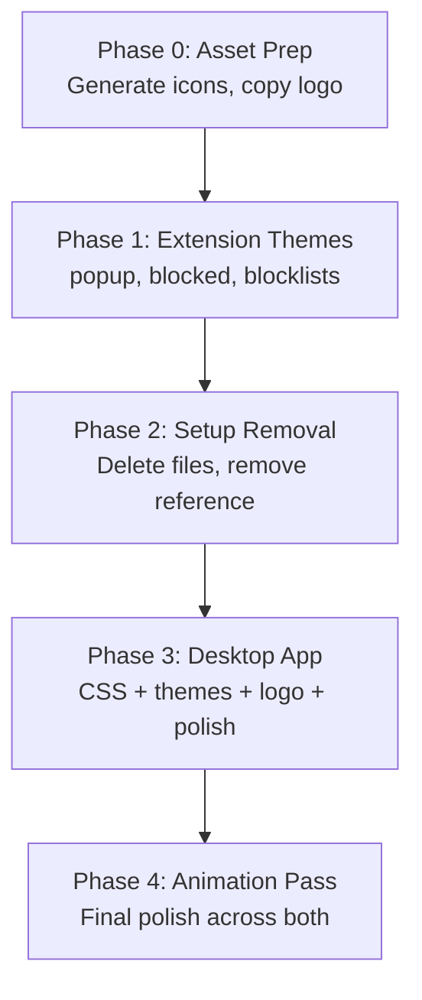

# Pure Path — UI Overhaul Implementation Plan

> **Goal:** Unify the visual identity of the Desktop App and Chrome Extension under one cohesive theme built around the new logo's color language — **Blue, Light Purple, Shades of Black, and White.**

---

## 🎨 Design Foundation — The Unified Palette

The new [Main_logo.png](file:///j:/Programs%20(Zipped)/Pure-Path-NSFW-blocker/icons/Main_logo.png) is a dual-diamond mark with a **cyan → blue** and **blue → purple** gradient. This gives us our palette:

| Token Role | Light Mode | Dark Mode (Default) |
|---|---|---|
| `--pp-bg-deep` | `#F0F4F8` | `#0B0E14` |
| `--pp-bg-surface` | `#FFFFFF` | `#10141E` |
| `--pp-bg-elevated` | `#FFFFFF` | `#171D2B` |
| `--pp-accent-1` (Blue) | `#3B82F6` | `#3B82F6` |
| `--pp-accent-2` (Light Purple) | `#8B5CF6` | `#A78BFA` |
| `--pp-gradient` | `135deg, #3B82F6, #8B5CF6` | `135deg, #3B82F6, #A78BFA` |
| `--pp-text-primary` | `#0F172A` | `#F1F5F9` |
| `--pp-text-muted` | `#475569` | `#94A3B8` |
| `--pp-glass-bg` | `rgba(255,255,255,0.7)` | `rgba(16,20,30,0.55)` |
| `--pp-glass-border` | `rgba(0,0,0,0.08)` | `rgba(139,92,246,0.12)` |
| `--pp-success` | `#10B981` | `#10B981` |
| `--pp-danger` | `#EF4444` | `#EF4444` |

> [!IMPORTANT]
> Only **Blue, Light Purple, Shades of Black, and White** are allowed. The current extension themes (Breeze, Lavender, **Forest**, Midnight) include green/pink — Forest and Lavender must be **removed or re-skinned** to comply.

---

## 📋 Scope & Surface Map

### What We're Changing (Frontend Only)

| # | Surface | Files | What Changes |
|---|---|---|---|
| 1 | **Desktop App** | `desktop-app/src/renderer/` (CSS, HTML, themes, page JS) | Full theme overhaul, logo swap, professional design |
| 2 | **Blocked Page** | `blocked.html`, `blocked.js` | New background, theme unification. **Middle section untouched.** |
| 3 | **Extension Popup** | `popup.html`, `popup.js` | Theme unification, remove "Security Settings" button |
| 4 | **Blocklists Page** | `blocklists.html`, `blocklists.js` | Theme variable alignment |
| 5 | **Setup Page** | `setup.html`, `setup.js`, `background.js:38` | **Deleted entirely**, reference removed |
| 6 | **Logo Assets** | `icons/` | Generate sized variants from `Main_logo.png` |

### What We're NOT Changing (Backend)

- `background.js` logic (except removing the `setup.html` tab-open call on line 38)
- `content.js`
- `blocklists/` JSON data
- `desktop-app/src-tauri/` Rust backend
- `desktop-app/native-host/`
- `manifest.json` permissions/structure (only `icons` paths if needed)

---

## 🏗️ Phase Breakdown

### Phase 0 — Asset Preparation
> Generate icon sizes and copy logo to all required locations.

| Task | Details |
|---|---|
| **0.1** Generate sized icons | From `icons/Main_logo.png` → create `icon16.png`, `icon48.png`, `icon128.png` in `icons/` |
| **0.2** Copy to desktop assets | Copy icons to `desktop-app/src/renderer/assets/` |
| **0.3** Verify manifest paths | `manifest.json` icon paths remain `icons/icon16.png` etc. — just the files change |

---

### Phase 1 — Unified Design Token System (Extension)
> Replace the 4-theme system in the extension with a clean 2-theme system (Dark/Light) using the new palette.

#### 1.1 — [popup.html](file:///j:/Programs%20(Zipped)/Pure-Path-NSFW-blocker/popup.html) CSS Overhaul

**Current state:** 4 themes via `[data-theme]` selectors — Breeze, Lavender, Forest, Midnight — with greens and pinks.

**Target:** 2 themes — `purepath-dark` (default) and `purepath-light`.

```diff
  :root {
-   /* Base variables for Breeze (Default) theme */
-   --bg-color: #f8fafc;
-   --card-bg: rgba(255, 255, 255, 0.7);
+   /* Pure Path Dark Theme (Default) */
+   --bg-color: #0B0E14;
+   --card-bg: rgba(16, 20, 30, 0.55);
    ...
  }

- [data-theme="lavender"] { ... }     ← REMOVE
- [data-theme="forest"] { ... }       ← REMOVE
- [data-theme="midnight"] { ... }     ← REMOVE
+ [data-theme="light"] { ... }        ← ADD (white/blue variant)
```

**Key CSS changes in popup.html:**
- Replace all 4 theme blocks (lines 9–72) with 2 unified themes
- Update gradient colors to `--pp-accent-1` → `--pp-accent-2`
- Swap logo `src` from `icons/icon48.png` to `icons/Main_logo.png` (or new sized version)
- Remove "Security Settings" button (lines 459–467)
- Remove the Forest & Lavender theme buttons from the themes view (lines 478–486)
- Replace theme picker with just Dark/Light toggle
- Keep repeatable animations (float, pulse, slideUp)
- Add new subtle repeating gradient shimmer animation on the status banner

#### 1.2 — [popup.js](file:///j:/Programs%20(Zipped)/Pure-Path-NSFW-blocker/popup.js) Updates

```diff
- // Change password button (placeholder for now)
- document.getElementById('changePasswordBtn').addEventListener('click', () => {
-   alert('Password change feature coming soon!...');
- });
```

- Remove `changePasswordBtn` event listener (lines 62–64)
- Simplify theme switching logic to only handle `dark` / `light`
- Update theme grid selectors to match new HTML

#### 1.3 — [blocked.html](file:///j:/Programs%20(Zipped)/Pure-Path-NSFW-blocker/blocked.html) Theme + Background

**Current state:** Has its own set of 4 theme variables + a `<canvas>` for GSAP fluid animation.

**Changes:**
- Replace the 4 theme variable blocks (lines 9–55) with 2-theme variables matching the unified palette
- **Background:** Replace current fluid canvas animation with a new one that uses the Pure Path blue/purple palette
- Swap logo from `icon48.png` to new logo
- **Middle section (`.container` inner content: h1, reason, quote, stats, message, button) → UNTOUCHED** as requested
- Update `.safe-btn` color to use `--pp-accent-1`

#### 1.4 — [blocked.js](file:///j:/Programs%20(Zipped)/Pure-Path-NSFW-blocker/blocked.js) Background Animation

- Update wave colors in the GSAP canvas animation (lines 112–116) to match new palette:
  - Replace pink/green tones → blue/purple gradient tones
  - Update orb colors (lines 119–123) to blue/purple spectrum
- Keep all animation timing/logic — just re-skin colors

#### 1.5 — [blocklists.html](file:///j:/Programs%20(Zipped)/Pure-Path-NSFW-blocker/blocklists.html) Alignment

- Replace 4 theme blocks (lines 10–69) with unified 2-theme variables
- Swap logo references from `icon48.png` → new logo
- Colors already mostly compatible, but need purple consistency

---

### Phase 2 — Setup Page Removal

#### 2.1 — Remove Extension Files

| File | Action |
|---|---|
| `setup.html` | **Delete** |
| `setup.js` | **Delete** |

#### 2.2 — Remove Setup Reference in [background.js](file:///j:/Programs%20(Zipped)/Pure-Path-NSFW-blocker/background.js)

Line 38 opens `setup.html` — this needs to be removed or replaced:

```diff
- chrome.tabs.create({ url: 'setup.html' });
+ // Setup page removed — password setup handled in-app
```

> [!NOTE]
> This is a **minimal backend touch** — just commenting out or removing one line. No logic changes.

---

### Phase 3 — Desktop App Theme Overhaul
> The desktop app currently uses a different design system ("Electric Ether" with violet/blue). We need to align it with the new unified palette while keeping its **professional** feel.

#### 3.1 — [styles.css](file:///j:/Programs%20(Zipped)/Pure-Path-NSFW-blocker/desktop-app/src/renderer/css/styles.css) Token Alignment

**Current tokens (lines 9–51):** `--violet`, `--blue`, `--frost`, etc.

**Changes:**
- Rename tokens to match the shared `--pp-*` prefix convention  
- Or — keep the desktop token names but update their **values** to exactly match the unified palette
- Update gradient directions to be consistent with extension
- The desktop already uses blue/purple — main change is ensuring **exact same hex values** as the extension

Key color mappings:
```
--violet       → --pp-accent-2   (#8B5CF6 / #A78BFA)  ← already close
--violet-dark  → stays aligned   (#7C3AED)
--blue         → --pp-accent-1   (#3B82F6)            ← already exact
--bg-deep      → --pp-bg-deep    (#0B0E14)            ← slight tweak from #0A0E17
--frost        → --pp-text-primary
```

Most values are already close — the overhaul is ensuring **pixel-perfect consistency**.

#### 3.2 — [index.html](file:///j:/Programs%20(Zipped)/Pure-Path-NSFW-blocker/desktop-app/src/renderer/index.html) Logo Swap

```diff
- 
+ 
```

Same for `sidebar-logo` (line 41).

#### 3.3 — Desktop Theme JSONs

Update the 3 theme files to use the unified palette values:

| File | Changes |
|---|---|
| `electric-ether.json` | Tweak `--bg-deep` from `#0A0E17` → `#0B0E14`, ensure accent consistency |
| `midnight-void.json` | Keep OLED-black concept, update accent colors to match |
| `frost-light.json` | Update to use the unified light palette values |

#### 3.4 — Professional Design Polish

The user specifically called out the desktop app looking like "AI slop." Key fixes:

1. **Remove excessive glassmorphism** — reduce `backdrop-filter` blur values, make cards more subtle
2. **Tone down hover animations** — current `translateY(-3px)` on every card feels gimmicky
3. **Refine typography** — tighten letter-spacing, reduce font-weight variation
4. **Add new repeatable animations:**
   - Subtle pulsing glow on the status badge
   - Smooth breathing animation on the sidebar active indicator
   - Gentle shimmer on gradient elements
5. **Status banner redesign** — more understated, professional security-tool look
6. **Card backgrounds** — use solid translucent backgrounds instead of heavy glass

#### 3.5 — Page JS Updates (Logo + Colors in Rendered HTML)

- [overview.js](file:///j:/Programs%20(Zipped)/Pure-Path-NSFW-blocker/desktop-app/src/renderer/js/pages/overview.js) — Colors are CSS-driven, minimal changes
- [themes.js](file:///j:/Programs%20(Zipped)/Pure-Path-NSFW-blocker/desktop-app/src/renderer/js/pages/themes.js) — Update `themesList` color previews, ensure label accuracy

#### 3.6 — [fluid-bg.js](file:///j:/Programs%20(Zipped)/Pure-Path-NSFW-blocker/desktop-app/src/renderer/js/fluid-bg.js) — WebGL Color Alignment

Update shader uniform defaults and theme-event handling to use the new unified color values.

---

### Phase 4 — Animation & Polish Pass

Add professional repeating animations across both systems:

| Animation | Location | Description |
|---|---|---|
| **Shield pulse** | Popup + Desktop status banner | Subtle scale+glow cycle on the status dot |
| **Gradient shimmer** | Status banners | Moving highlight across gradient surfaces |
| **Card entrance** | All pages | `slideUp` with stagger — already exists, keep |
| **Logo breathe** | Desktop sidebar | Gentle scale oscillation on the app logo |
| **Background drift** | Blocked page + Desktop | Slow-moving gradient orbs/particles |
| **Hover micro-animations** | Buttons + Cards | Subtle scale/translate, keep existing |

> [!TIP]
> External library already in use: **GSAP** (both blocked.js and desktop app). We can leverage GSAP for all new animations without adding new dependencies. **Three.js** is already loaded for the desktop fluid background.

---

## 📁 Complete File Change Inventory

### Extension Root

| File | Action | Scope |
|---|---|---|
| `popup.html` | **Major rewrite** | CSS tokens, theme reduction, logo, remove security btn |
| `popup.js` | **Edit** | Remove security btn listener, simplify theme logic |
| `blocked.html` | **Edit** | CSS tokens only + logo, middle content untouched |
| `blocked.js` | **Edit** | Re-skin animation colors only |
| `blocklists.html` | **Edit** | CSS token alignment + logo |
| `blocklists.js` | **No change** | Logic unchanged |
| `setup.html` | **DELETE** | Entire file removed |
| `setup.js` | **DELETE** | Entire file removed |
| `background.js` | **1-line edit** | Remove `setup.html` tab create (line 38) |
| `manifest.json` | **Possibly no change** | Icon paths remain same, files replaced in-place |
| `icons/Main_logo.png` | **Exists** | Source for generated sizes |
| `icons/icon16.png` | **Replace** | Generated from Main_logo |
| `icons/icon48.png` | **Replace** | Generated from Main_logo |
| `icons/icon128.png` | **Create** | Generated from Main_logo |

### Desktop App (`desktop-app/src/renderer/`)

| File | Action | Scope |
|---|---|---|
| `index.html` | **Edit** | Logo paths |
| `css/styles.css` | **Major rewrite** | Token values, card styles, animation refinement |
| `themes/electric-ether.json` | **Edit** | Align values to unified palette |
| `themes/midnight-void.json` | **Edit** | Align accent colors |
| `themes/frost-light.json` | **Edit** | Align light palette values |
| `js/theme-manager.js` | **Minor edit** | Default theme name if changed |
| `js/pages/overview.js` | **No/Minor** | Colors are CSS-driven |
| `js/pages/themes.js` | **Edit** | Theme list colors, descriptions |
| `js/fluid-bg.js` | **Edit** | WebGL default color uniforms |
| `js/app.js` | **No change** | Router logic unchanged |
| `js/gsap-transitions.js` | **No change** | Animation utilities unchanged |
| `assets/icon48.png` | **Replace** | New logo |
| `assets/Main_logo.png` | **Create** | Copy of new logo |

---

## ⚡ Execution Order



> [!WARNING]
> Phase 1 and Phase 3 must share the **exact same hex values** for every design token. Any drift between them defeats the purpose of the unification.

---

## ✅ Acceptance Criteria

1. Extension popup and Desktop app are **visually indistinguishable** in color language
2. Only **Blue, Light Purple, Black shades, and White** appear anywhere
3. No green, pink, or other off-palette colors remain
4. New logo appears in all locations (popup header, blocked page, blocklists navbar, desktop titlebar + sidebar)
5. Setup page is fully removed with no broken references
6. "Security Settings" button is gone from the popup
7. Blocked page middle section is **exactly preserved**
8. All existing GSAP/Three.js animations still function, re-skinned to new palette
9. Desktop app feels **professional**, not overly stylized
10. Both dark and light themes are available and consistent
